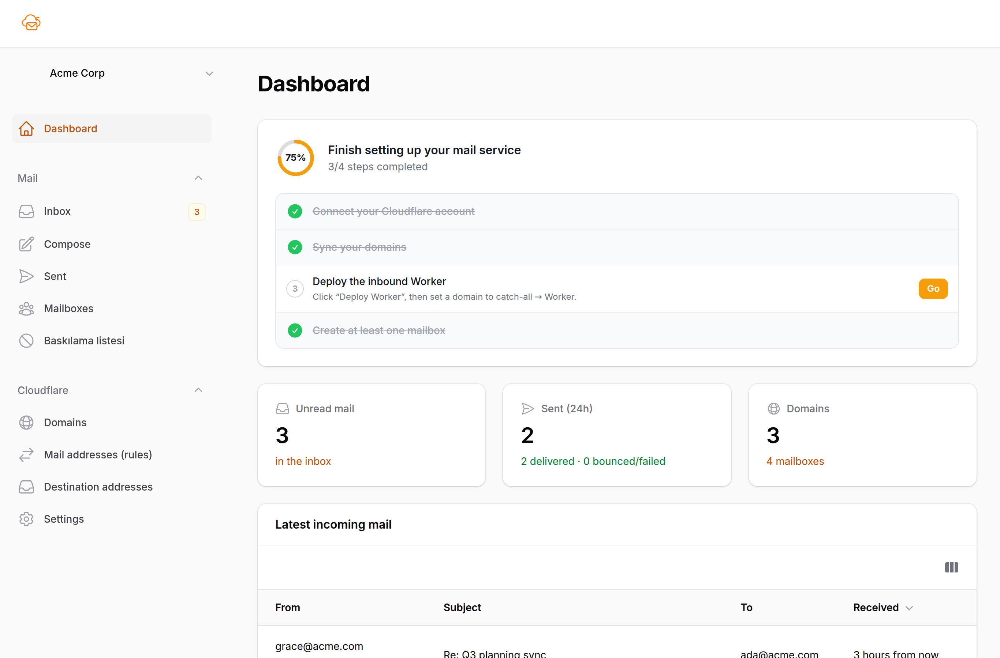
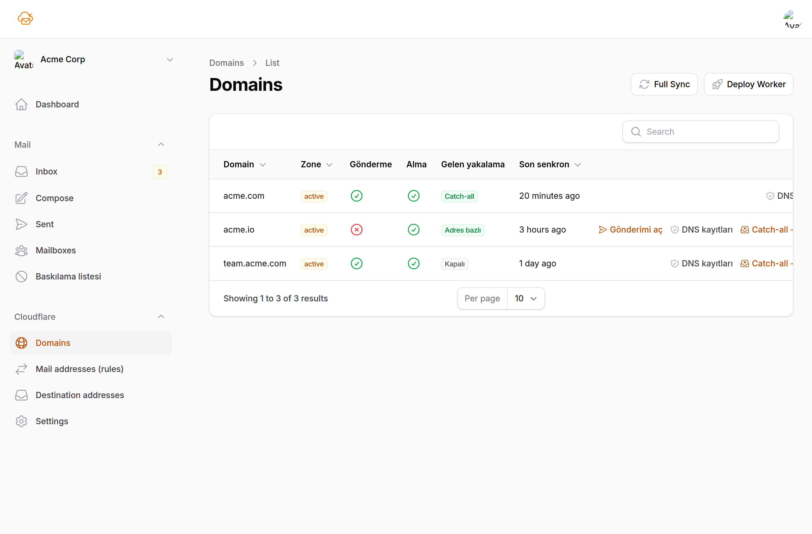
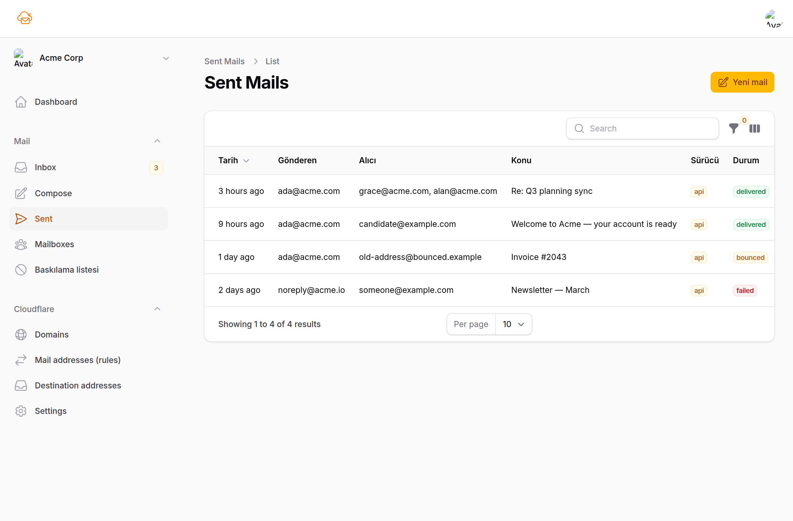
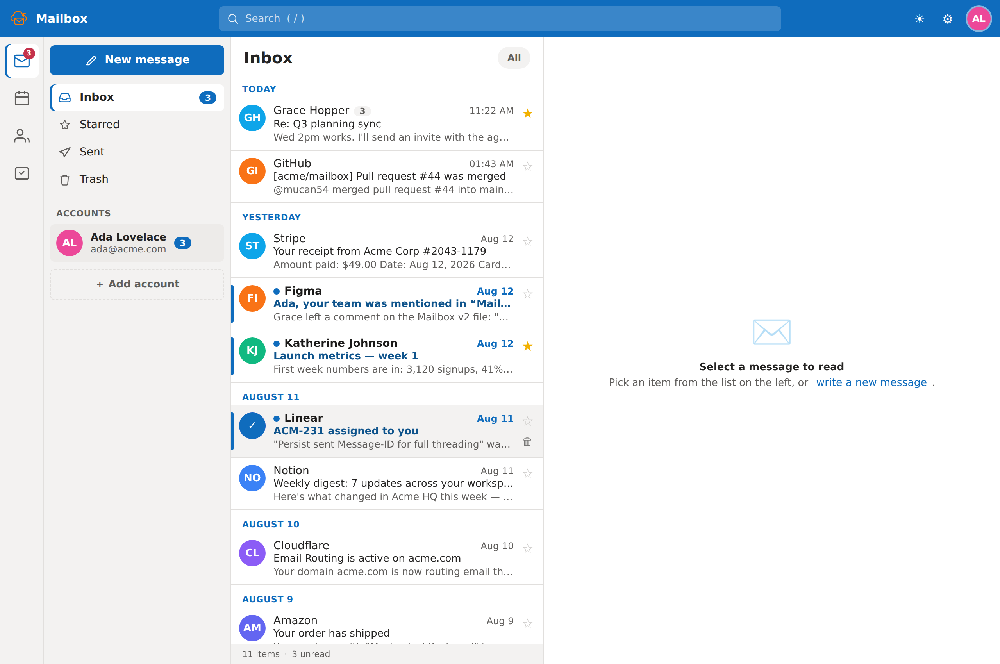
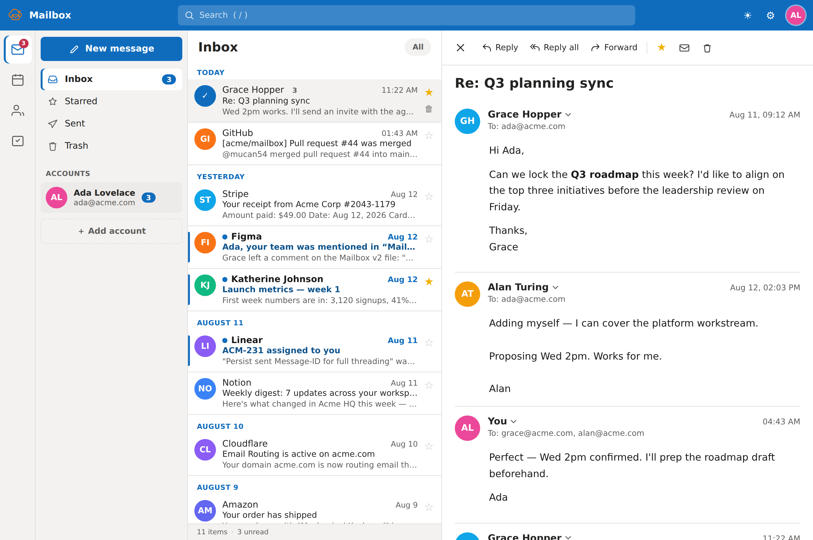
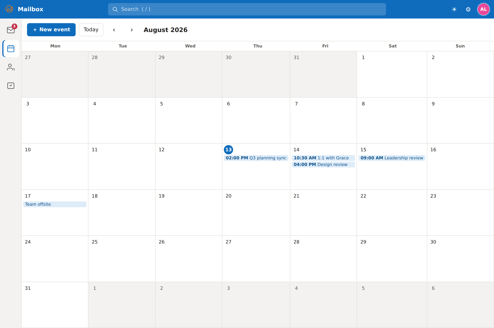
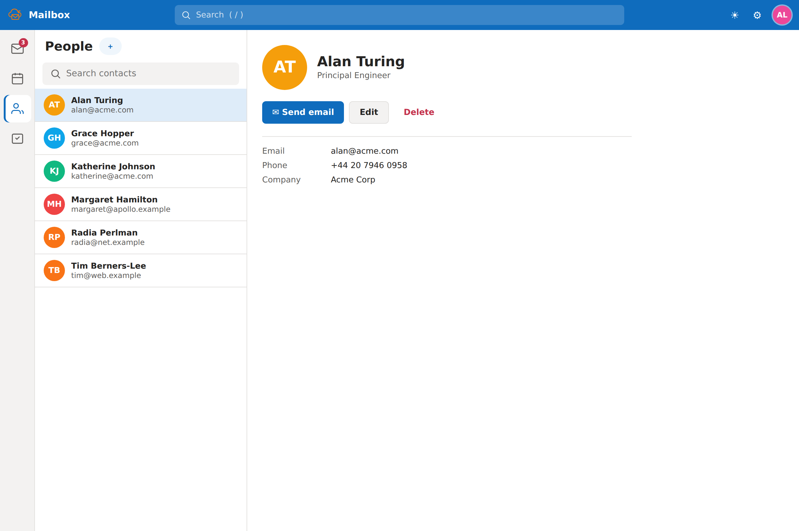
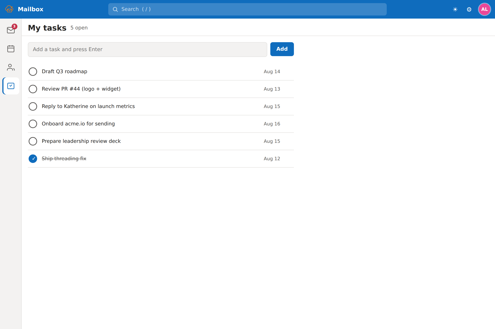
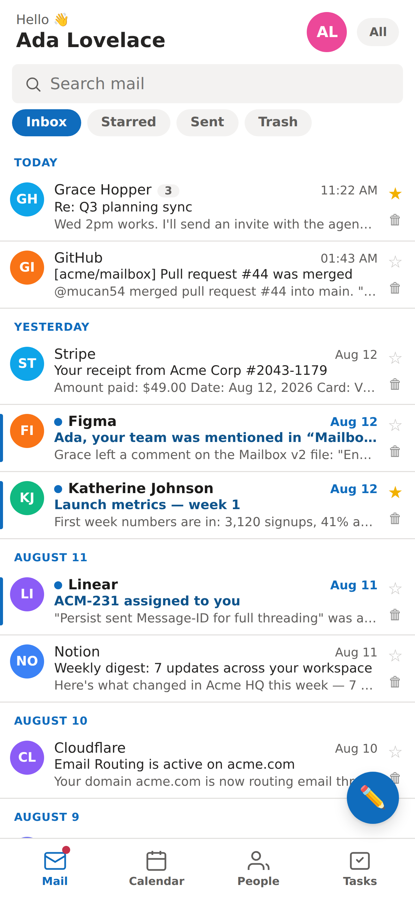

<p align="center">
  
</p>

<h1 align="center">Cloudflare Mailbox</h1>

A multi-tenant web mail service built on **Cloudflare Email Service** (Sending +
Routing), with a **Laravel + Filament** admin panel and a **headless Vue SPA (PWA)**
mailbox portal. Send and receive email on your own domains, manage routing, and give
each address its own installable, push-notified inbox.

See [`docs/ARCHITECTURE.md`](docs/ARCHITECTURE.md) for the full design.

## Screenshots

> Populated with demo data — reproduce locally with
> `php artisan migrate:fresh && php artisan db:seed --class=DemoSeeder`
> (admin `admin@example.com` / `password`, mailbox `ada@acme.com` / `password`).

**Admin panel** (Filament)

| Dashboard | Domains | Sent log |
|:---:|:---:|:---:|
| [](docs/screenshots/admin-dashboard.png) | [](docs/screenshots/admin-domains.png) | [](docs/screenshots/admin-sent.png) |

**Mailbox portal** (Vue PWA)

| Inbox | Conversation | Calendar |
|:---:|:---:|:---:|
| [](docs/screenshots/mailbox-inbox.png) | [](docs/screenshots/mailbox-conversation.png) | [](docs/screenshots/mailbox-calendar.png) |

| People | Tasks | Mobile (installable PWA) |
|:---:|:---:|:---:|
| [](docs/screenshots/mailbox-people.png) | [](docs/screenshots/mailbox-tasks.png) | [](docs/screenshots/mobile-inbox.png) |

## What it does

- **Admin panel** (`/admin`, Filament, multi-tenant — one Cloudflare account = one
  tenant): one-click token onboarding, domain/address/routing-rule sync & management,
  compose & sent log, inbox, inbound-Worker deploy.
- **Mailbox portal** (`/`, Vue SPA + PWA): per-address login (email + password),
  native-feeling inbox, compose, and Web Push "new mail" notifications — installable
  on Android & iOS.
- **Sending**: Cloudflare REST API (default) or SMTP, switchable via config.
- **Receiving**: a Cloudflare **Email Worker** (`cf/`) parses inbound mail and posts
  it to a signed webhook; Laravel stores it and pushes a notification.
- **Native mail apps** (optional, off by default): an IMAP/SMTP bridge
  ([`mailserver/`](mailserver/), shipped as the ready-to-deploy
  [`docker-compose.native.yaml`](docker-compose.native.yaml)) plus CalDAV/CardDAV
  served at `/dav` and mail-client autodiscovery, so Apple Mail / Outlook /
  Thunderbird and native calendar & contacts can connect. See
  [Native mail apps](#native-mail-apps-optional) below.

## Requirements

- PHP 8.3+, Composer, Node.js 20+ (Node + `wrangler` are needed to deploy the Worker)
- A database (SQLite for dev, MySQL for production)
- An S3-compatible bucket for attachments in production (AWS S3 / Cloudflare R2 / MinIO)
- A domain on **Cloudflare DNS**

## Local setup

```bash
composer install
cp .env.example .env
php artisan key:generate
touch database/database.sqlite
php artisan migrate --seed          # seeds admin@example.com / password
php artisan webpush:vapid        # VAPID keys for Web Push
npm install
npm run build                       # or: npm run dev
php artisan serve
```

- Admin panel: `http://localhost:8000/admin` (`admin@example.com` / `password`)
- Mailbox portal: `http://localhost:8000/`

### Connect Cloudflare

In the admin panel, add a Cloudflare account (tenant). Click **"Cloudflare token
oluştur"** — it opens Cloudflare's token page with the exact permissions pre-selected
(Email Routing: Edit, Email Sending: Edit, Zone: Read). Create the token, paste it,
and the app auto-detects your account. Then **Full Sync**, then **Deploy Worker**.

## Inbound Worker

The inbound Email Worker lives in [`cf/`](cf/) and is deployed from Laravel:

```bash
php artisan cf:deploy-worker {tenant}   # render wrangler.toml + deploy + set secret
php artisan cf:worker:status            # up-to-date / drifted / never deployed
php artisan cf:worker:sync              # redeploy drifted tenants (idempotent)
```

## Native mail apps (optional)

Everything above is a self-contained web app. This section is **entirely optional** —
the plain Laravel deploy runs fine without any of it, and none of it is enabled by
default. Turn it on only if you also want to reach your mailboxes from native clients.

### Calendar & contacts (CalDAV / CardDAV) — no extra service

CalDAV and CardDAV are HTTP-based, so Laravel serves them itself at `/dav` (via
`sabre/dav`) — no extra ports, no Docker, behind the same Coolify/Cloudflare HTTPS.
Enable with:

```env
MAIL_CLIENT_DAV=true
```

Each mailbox then syncs its calendar (the `events` table) and contacts to **iOS/macOS**
(native Calendar/Contacts) and **Android** (via the DAVx5 app). RFC 6764 discovery
(`.well-known/caldav|carddav` + `_caldavs`/`_carddavs` SRV records) lets clients set up
from just email + password, and there's a one-tap Apple configuration profile at
`/mail/profile/<email>.mobileconfig` that bundles **Mail + Calendar + Contacts**.

### IMAP / SMTP for native mail apps

Reading and sending over **IMAP/SMTP** needs a small extra service: IMAP/SMTP are
raw-TCP protocols, so (unlike CalDAV/CardDAV) they can't run inside the HTTP app. The
bridge lives in [`mailserver/`](mailserver/) — a stateless Go service that stores
nothing and proxies every IMAP/SMTP action to the Laravel mailbox API.

Rather than bolt it on, the deployment offers **two complete, production-ready compose
files — pick one:**

| Deploy this file | You get |
|---|---|
| [`docker-compose.yaml`](docker-compose.yaml) | The web PWA stack (app + worker + scheduler + MySQL + Redis). No native mail apps. |
| [`docker-compose.native.yaml`](docker-compose.native.yaml) | Everything above **plus** the IMAP/SMTP bridge (and CalDAV/CardDAV turned on), wired together internally. |

So to add native mail apps you don't run a second Coolify resource — you just point the
**Docker Compose Location** at `docker-compose.native.yaml` instead. The bridge talks to
the app over the internal Docker network (`http://app:8080`), so there's no public
round-trip and it's one shared deploy. The extra env for that file:

```env
# Public host clients use for IMAP/SMTP — a GREY-CLOUD (DNS-only) record at this
# server's IP (Cloudflare's proxy can't carry raw IMAP/SMTP).
MAIL_CLIENT_SERVER_HOST=mail.example.com
# Optional: real IMAP/SMTP TLS certs (else a self-signed cert is generated).
TLS_DIR=/path/with/certs    # mounted at /certs
TLS_CERT=/certs/fullchain.pem
TLS_KEY=/certs/privkey.pem
```

With it on, the app serves autodiscover/autoconfig XML so Apple Mail / Outlook /
Thunderbird configure themselves from just the address, and the DNS records
(autodiscover/autoconfig/mail CNAMEs, `_imaps`/`_submission` + CalDAV/CardDAV SRV) are
provisioned per domain automatically (`MAIL_CLIENT_AUTO_DNS`) or on demand from the
admin panel's **Domains → "Mail istemci DNS"** action.

> Advanced: [`docker-compose.mailserver.yml`](docker-compose.mailserver.yml) runs the
> bridge **on its own** (as a separate Coolify resource reaching the app by its public
> URL) — only needed if the app isn't deployed from `docker-compose.native.yaml` (e.g.
> a Dockerfile build pack or a separate host).

See **[`mailserver/README.md`](mailserver/README.md)** for the full walkthrough — env
vars, TLS, and scope/limitations.

## Production (Coolify)

Deploy the whole stack — app + MySQL + Redis + queue worker + scheduler — from the
included [`docker-compose.yaml`](docker-compose.yaml). It builds the
[`Dockerfile`](Dockerfile) (php-fpm + nginx via serversideup/php, plus Node +
`wrangler` so the inbound Worker deploys from the container).

1. **Build Pack: `Docker Compose`** (Configuration → General). Set Docker Compose
   Location to `/docker-compose.yaml`. (Not Nixpacks — it would ship without
   `wrangler` and break Deploy-Worker.)
2. **Environment Variables** — only the attachment (R2/S3) secrets are needed, and
   even those are optional (mail send/receive works without them; only storing
   attachments needs them):
   ```env
   AWS_ACCESS_KEY_ID=…       AWS_SECRET_ACCESS_KEY=…
   AWS_BUCKET=…              AWS_ENDPOINT=https://<id>.r2.cloudflarestorage.com
   ```
   Everything else is automatic: Coolify generates & persists `APP_KEY`
   (`SERVICE_REALBASE64_APPKEY`), the domain (`SERVICE_URL_APP` → `APP_URL`), and the
   MySQL password (`SERVICE_PASSWORD_MYSQL`); `VAPID_SUBJECT` defaults to the app URL.
   MySQL, Redis, the queue worker and the scheduler come up on their own; migrations
   run on boot (serversideup AUTORUN). Web Push is off until you set a VAPID keypair
   (see below).
3. **Deploy**, then create your admin user from the Coolify **Terminal** with your own
   credentials (don't use the insecure default seeder in production):
   ```bash
   php artisan app:create-admin you@yourdomain.com --name="You"
   ```
   It prompts for a password, then you can log in at `https://<your-domain>/admin`.
4. Deploy the inbound Worker from the admin panel's **Deploy Worker** action (or the
   Coolify Terminal: `php artisan cf:worker:sync`).

`APP_KEY` and `VAPID_SUBJECT` are generated automatically. Attachments need the
`AWS_*` (R2/S3) vars; mail send/receive works without them.

### Enabling Web Push notifications (optional)

Push is off until you set a VAPID keypair. It can't be auto-generated (it's a stable
EC keypair — rotating it breaks every existing subscription), so generate it **once**
and set two env vars:

1. In the Coolify **Terminal**, run (the `--show` flag prints the keys instead of
   writing a `.env`, which the container doesn't have):
   ```bash
   php artisan webpush:vapid --show
   ```
   It prints a `VAPID_PUBLIC_KEY` and `VAPID_PRIVATE_KEY`.
2. Add both to Coolify → **Environment Variables** and redeploy.

**`VAPID_SUBJECT` must be a `mailto:` or `https://` URL** — it identifies you to the
push services (Apple/iOS is strict and silently rejects an invalid value, so no
notification arrives). Set it to a contact address, e.g.:

```
VAPID_SUBJECT=mailto:you@yourdomain.com
```

If you leave it unset it falls back to `APP_URL` (a valid `https://` URL). A bare
value like `mailbox` is invalid; the app normalises an email-looking value to
`mailto:<email>` and otherwise falls back to `APP_URL`, but set it explicitly to be safe.

Keep the keys stable across deploys (rotating them invalidates every existing
subscription — users must re-enable notifications). On iOS (16.4+), push only works
once the user installs the PWA to the Home Screen (Add to Home Screen), opens it from
the Home Screen icon, and grants permission via the in-app "Bildirimleri aç" prompt.

### Notes

- **APP_URL must be your real public domain** — it is both the inbound webhook base
  (`{APP_URL}/api/cf/incoming`) and the SPA service-worker scope. The compose file
  wires it from Coolify's generated domain automatically.
- Tenant Cloudflare tokens and webhook secrets live **encrypted in the database**,
  never in env.
- `php artisan cf:deploy-worker` / `cf:worker:sync` need outbound HTTPS to Cloudflare
  from the container (allowed on standard Coolify networking).
- Prefer a managed/external database? You can instead use the `Dockerfile` build pack
  and add MySQL/Redis as separate Coolify resources, wiring `DB_*`/`REDIS_*` env vars
  yourself — but the compose stack above is simpler and self-contained.

## Testing

```bash
php artisan test        # full feature suite (108 tests)
vendor/bin/pint         # code style
```

## License

MIT.
